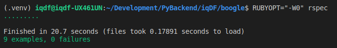

# Boggle Game API

Boggle Game API is a solution engineered for hosting simple Boggle Game. The REST API is written in Python3 using `Flask` webframework and has testing suite available both in Python (unit-tests and integration tests) and Ruby (end-to-end tests).

## Boggle Game
Boggle is a word game that is played on a 4x4 board with 16 letter tiles.
The goal is to find as many words as possible given a time constraint.

Now it is possible for one or more of the letter tiles to be blank (denoted by `*`).
When a tile is blank, it can be treated as any other letter.  Example board:

```
A C E D
L U G *
E * H T
G A F K
```

Some sample words from this board are ace, dot, dug, eight, hole, huge, hug, tide.


## Installation & Setup


This project requires [Python 3](https://www.python.org/) and [Ruby](https://www.ruby-lang.org/en/documentation/installation/), followed by some libraries.


### Requirements

- `python >= 3.6`
- `MongoDB`
- `python3-venv`
- `ruby >= 2.5`
- `git`


### Python3 and Python3-venv

#### Install Python3
You can directly download the binary source from 

If you're using linux/ubuntu (12.0 - 18.04) you can install `python3` by using `apt-get` as follows:

```bash
$ sudo apt-get update
$ sudo apt-get install python3.6
$ python3 --version  # check installation successful
$ which python3  # check software bash directory
```

#### Install & Setup Venv

Then install virtualenv manager. There are many python virtualenv manager but here we choose to pick `venv`. To install, run `apt-get` command:

```bash
$ sudo apt-get install python3-venv  # install venv
$ python3 -m venv .venv  # create virtual environment called .venv
```

#### Install Python Packages
```bash
$ source .venv/bin/activate  # activate virtual environment (.venv)
(.venv) $ pip3 install -r requirements.txt # ensure you are using .venv and python 3.6
```

### Ruby

First, install [Ruby](https://www.ruby-lang.org/en/documentation/installation/). Then run the following commands under the project directory.

```
$ruby -v # confirm Ruby present
ruby 2.5.1p57 (2018-03-29 revision 63029) [x86_64-darwin17]

$ gem install bundler # install bundler to manage dependencies
$ bundle install  # install dependencies using Gemfile
...
...
Bundle complete! 3 Gemfile dependencies, 8 gems now installed.

```


## Mongo DB Setup

You need to install `Mongo` DB in your machine.

```bash
$ sudo apt install -y mongodb
$ sudo systemctl status mongodb  # check mongodb status
$ sudo systemctl start mongodb   # if mongodb not active/running, start db using systemctl
```


## Run Server
The entry points for running `Flask` application is the `run.py` script. There are several environment variables that you can provide yourself or using the `.env` file.

```bash
export DATABASE_URI=mongodb://localhost:27017/testboggledb  # get your db url
export FLASK_ENV=testing  # testing mode
export DEBUG=1  # debug mode
export UNIT_TEST_MODE=1  # disable logging for unit testing

python run.py # available at 127.0.0.1:5000
```

## Run Testing

Execute the script below to run all tests in pytest.

```bash
(.venv)$ python3 run_pytest.py
```
------

### Tests Results

- Commit : 148139a


- Commit: 148139a


